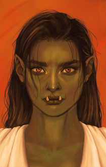

# Shithri the Pirate

Shithri is a female half-orc swashbuckler companion who's always ready for a drink. Being a half-orc piratess and originating form Zenthil Keep, she may make your companions rather detached or suspicious... but who could refuse when asked: "Ho, me matey! Care fer a draught?"

This mod is, by-desing, dual-language - in most cases both the English and the Polish version can be considered "the original" (it's usually bolded when that isn't the case).

Featuring:

 * [pirate speech](#Language) - Shithri speaks in a highly stylized pirate way. Playing in your native language, if available, is recommended.
 * orcish language and culture - being a half-orc worshipper of Luthic, Mother of Caves, Shithri uses a few words from orcish language here and there, as well as quote orcish prayers and other pieces of culture. Because it may contain spoilers, orcish language and culture summary is in a separate file, [Shithri\_spoilers.md](./Shithri_spoilers.md).
 * shanties and sea songs - being a pirate, Shithri couldn't live without songs. Enjoy the DnD-ized versions of classy sea songs!
 * naval culture - get ready for some naval terms here and there, as Shithri isn't shy about them.
 * banters - Shithri not only talks with her fellow companions, but forms strong bonds with many of them. Because the summary of party banters contains spoilers, it is in a separate file, [Shithri\_spoilers.md](./Shithri_spoilers.md).
 * in-party romance - unlike most romancable companions, Shithri can romance not by the PC (or CHARNAME, if you may), but a specific companion. She may also enter a friends-with-benefits relationships. Rather obviously, the details contain heavy spoilers, so they're in a separate file, [Shithri\_spoilers.md](./Shithri_spoilers.md).
 * SoA quest - a lore-heavy, dialogue-based one, no fighting involved. Details in [Shithri\_spoilers.md](./Shithri_spoilers.md) file.

## Language

Shithri speaks in a highly stylized pirate way, which is described in-universe as "the Zentish accent". There are numerous reasons for that:

 * having spend many years sailing on the Sea of Falling Stars, Shithri is very accustomed to the ways of the sea, hence the naval elements in her speech
 * being a half-orc from Zenthil Keep implies she comes from the lower class - her speech reflects that
 * people from different countries may have different accents, Shithri is from Zenthil Keep, which is quite far from Amn and the Sword Coast
 * due to being raised by orc mother and uncle, Shithri's first language is orcish, not Common, which may explain her accent
 * well, she actually IS a pirate, so she speaks in a piratey way

The exact implementation of "pirate speech" differs between language versions.

### English

Shithri uses what is commonly called "pirate English". It's basically archaized English with a few phonetical changes (e.g. my -> me, just -> jus', sailing -> silin') and simplified grammar (e.g. am/is/are -> "be", 'm not/isn't/aren't -> "nah be" or even just "nah").

Aside from that, she uses a handful of pirate-themed terms, naval terms and other non-obvious words, all listed below (alphabetically):

 * ahoy! - a word used as a greeting or to catch someone's attention
 * avast! - stop!
 * bella - beautiful woman.
 * blimey! - exclamation of surprise, short for "[Gods] blind me!"
 * bosun - the person on the ship responsible for dealing with ropes.
 * buccaneer - pirate. Shithri uses it (or its short form, "bucko") as a "respectful" way to speak of pirates.
 * bucko - short for buccaneer. Pirate.
 * bumbo - more fancy pirate drink, consisting of water, rum, sugar and cinnamon or nutmeg (or both).
 * (this) business - piracy
 * capt'n - literally "capitain", but sometimes used jokingly. For a serious term, check: "old man/woman".
 * carouser - a person who drinks a lot.
 * draught - a single serving of alcoholic drink: a mug of ale, a glass of wine etc.
 * godly-ma - mother-goddess, mother of god. In orcish culture: goddess of caves, Luthic.
 * grog - a typical pirate drink, consisting of two parts water, one part rum and some lemon or lime juice.
 * handsomely - quickly
 * hearty - amicably of a teammate. Roughly the equivalent of "friend".
 * ho! - a word used to express emotions or catch someone's attention
 * hussyboy - gallant, womenizer
 * knave - a servant boy
 * lad - a young man, boy
 * lady - woman, often attractive one but not necessarily.
 * lass - young woman.
 * lassie - young girl, female kid.
 * letter o' marque - letter of marque, a document permitting one to attack and capture ships of an enemy nation. Makes one a "privateer".
 * long clothes - the clothes non-sailors wear, but particularly robes, skirts, dresses and the like. Pirates tend to wear clothes that stick close to the body.
 * lubber, land lubber - a non-sailor person, one living on the land
 * ma - mother
 * matey - neutral of a teammate. Roughly the equivalent of "companion".
 * marlinspike - a tool used in marine ropework. It looks similar to a very thick, 6-18 inches (15-60 cm) long needle or nail.
 * nah - "no" as a negator: "can nah"
 * nay - "no" used as a negative response: "- Can I have some? - Nay."
 * nipperkin - (of an alcoholic drink) one eighth of a pint, 60-70 ml. Shithri also uses it meaning "very small amount" (of alcoholic drink), as opposed to draught, "the standard/typical amount".
 * old man/woman - the kinda-amicable naval way to speak of the capitain.
 * pa - father
 * pirate - one who robs at sea or plunders the land from the sea without comission from a country (if they do, it's privateer). Shithri considers this term impolite and prefers "buccaneer" (or "bucko", for short).
 * privateer - or corsair, a person who has letter o' marque. You could say it's government-approved pirate.
 * reckon - usually means "imagine" (as in: "reckon that!") or "understand" (as in: "I reckon that").
 * riggin' - system of ropes, cables and chains, which support a ship's mast
 * scurvy - a disease, common among sailors, resulting from lack of vitamin C. Advanced symptoms include loosening, decay or even losing teeth.
 * sea dog - sailor, especially an experienced one
 * shanty - also known as "sea shanty" or "chanty", is a kind of naval folk song, commonly used as work song. Not every sea song is a shanty, although Shithri occasionally calls sea songs that.
 * smartly - quickly and efficiently
 * splice the mainbrace - have a drink
 * squiffy - under the influence of alcohol or - more generally - a person who drinks often.
 * swab - a highly disrespectful term to describe a person
 * swasher - flamboyant adventurer, especially one wielding swords.
 * swashin' - flamboyant sword-fighting.
 * tar - sailor
 * yarrr! - a kind of grunting sound, may be used to bold some part of the sentence or statement

Additionally, Shithri's speech has the following personal characteristics:
 * specific pronunciation of "huh"
 * often adressing herself in third person ("this bucko", "this tar")
 * often bolding with "aye" + be/do ("Only swabs be hatin' shanties, aye they be")

### Polish

Because Poland has historically had no colonies nor was sailing much outside of the Baltic sea, it missed the Golden Age of Piracy altogether. While sea songs and shanties are vastly popular in Poland, there is hardly a distinct way of speaking that people would associate with pirates.

Because of that, we decided to craft our own "pirate Polish"! Combining the Kociewie dialect and terms from prison jargon and naval slang, we created a unique mix to reflect both Shithri's the piracy as well as her background.

The linguistic details and subtleties may be difficult to explain to a person without the prior knowledge of the Polish language, while describing it in English may be overly alien to Polish language native speakers who don't speak English very well, so the detailed description below will be written in Polish:

Język bazowany na:
 * gwarze kociewskiej
 * gwarze więziennej
 * lekko stylizowany na stary
 * okraszony "sebiksizmami"

Cechy wzięte z gwary kociewskiej (uwaga - nie wszystkie są używane konsekwentnie):
 * Przy odmianie czasowników używa "żeś" (np. ty żeś poszedł). Bywa opuszczana (np. ty poszedł).
 * -kaj tworzy zdrobniałe formy czasowników (np. idźkaj).
 * Końcówka -y w mianowniku l.mn. rodz. m. zamiast -owie (np. pany).
 * Końcówka -ów w dopełniaczu l. mn. wszystkich rodzajów (chłopów, dziewczynów, kurów, jajów).
 * Forma dóma zamiast w dómu (miejscownik l.poj.).
 * -ma w 1 lmn. rozkazującej (np. róbma, idźma).
 * zmiękczenie "chy" do "chi" (np. "chiba" zamiast "chyba").
 * stwardnienie św', ćw', dźw' (np. "śweci" zamiast "świeci")
 * stwardnienie m' w -ami do "amy" (np. "statkamy" zamiast "statkami").
 * twarde k przed e (np. "kedyś" zamiast "kiedyś").
 * -ar- w -er-  - potwierdza tylko część źródeł, może używać niekonsekwentnie (np. "poderty", ale "umarł").
 * -ak w zdrobnieniach (np. dzieciak, cielak, prosiak).
 * "dwa" używane we wszystkich rodzajach gramatycznych (np. "dwa kobiety").
 * w czasie przeszłym formy męskoosobowe dla wszystkich rodzajów gramatycznych (np. "dziewczyny byli").
 * -ył w -uł (np. "chodziuł").
 * -óm w 1 os. l.poj. czasownikach (np. "gadóm" zamiast "gadam").
 * -ół zamiast -ął w 3os. l.poj. czasu przeszłego (np. kopnół, przełknół).
 * końcówki często -em w -am (np. "boram" zamiast "borem").
 * -ali w -eli (np. "śpieweli" zamiast "śpiewali").
 * -m w czasownikach 1 os. l.mn. (np. przyjdziem).
 * -ta w rozkazach (np. chodźta), również w l.poj. jako wyraz wyłączności.
 * -or, -ora jako formy ekspresywne (np. "gapior" jako "gapa", "babora" jako "baba").
 * Przyrostek -ón dla form zgrubiałych (np. "psión", od "pies").
 * Zdrobnienia przez -uszek/-iszek/-yszek (np. "kubuszek", tj. kubeczek; "woryszek", tj. koreczek; "chłopaszek", tj. chłopaczek).
 * Częste używanie strony biernej (np. "już jes wszystko kupione").
 * Końcowe nosówki się odnosówkowują (np. "nogo" zamiast "nogą", "dzwoniu" zamiast "dzwonią").
 * W śródgłosie -ę- wymawiane wąsko (np. "rynka" zamiast "ręka"). Czasami podobnie -ą- (np. "pobłóndził" zamiast "pobłądził").

Przykładowa odmiana - rzeczownik "morze":

| poj. | forma   | mn.   | forma   |
|------|---------|-------|---------|
| M.   | morze   |  M.   | morza   |
| D.   | morza   |  D.   | morzów  |
| C.   | morzu   |  C.   | morzóm  |
| B.   | morze   |  B.   | morza   |
| N.   | morzAM  |  N.   | morzami |
| Msc. | morzu   |  Msc. | morzach |
| W.   | morze   |  W.   | morza   |

Dodatkowo cechy osobnicze Shithri:
 * "huh" wymawiane jako charakterystyczny przydech ("Éh!")
 * często odnosi się do siebie samej w 3 os. ("ta galernica", "ta morska wilczyca")

Słowniczek:
 * ahoj! - rodzaj powitania lub zwrócenia uwagi na mówiącego
 * (za)ajkać - ugłaskać. Typowe użycie: matka ajkająca dziecko, które rozbiło sobie kolano.
 * arrr! - rodzaj chrząknięcia, może pełnić w zdaniu lub wypowiedzi funkcję wzmacniacza
 * awanturnik / awanturnica - osoba prowadząca burzliwe życie, często pełne przygód. Shithri używa tego określenia także jako eufemizm na pirata / piratkę.
 * biełka - dziewczyna
 * bierze - biorę (!), bierze
 * biesić sie, biesić sia - gniewać się
 * bosman / bosmanka - osoba odpowiedzialna na statku za żagle i liny
 * bożematka - bogini-matka lub bogurodzica. W przypadku orków: bogini jaskiń, Luthic.
 * bulwa - grubas, osoba otyła
 * bumbo - nieco bardziej wyszukany napój alkoholowy zrobiony z wody, rumu oraz gałki muszkatołowej lub cynamonu
 * burgot / burgota - zrzęda
 * chciwolec / chciwucha - skąpiec
 * chlejtus / chlejtucha - pijak
 * chłatko - szybko i sprawnie
 * chwacki - śmiały
 * chwatko - szybko
 * cianżko - ciężko
 * ckny - tęskny
 * czarowaństwo - magia, czarowanie
 * czechlić - skrobać (warzywa)
 * dochtór / dochtórka - doktor, lekarz
 * dupuś / dupcia - fujara, niezdara, niedołęga
 * dziarski - pełen życia
 * dzinkuje - dziękuję
 * echt - znakomity, bardzo dobry
 * fafrot / fafrota - gaduła
 * fandzolić - opowiadać głupoty
 * fejny - dobrej jakości, świetny
 * flankerować - spacerować, włóczyć się
 * flaszka - butelka
 * fleja - osoba niechlujna
 * folgować - pobłażać, przyzwalać, odpuszczać
 * (po)folgować se - oddać się przyjemnościom
 * forsowny - męczący
 * głodak / głodka - obżartuch
 * gorzkota - gorzkość
 * golnóć se, golnóć so - wypić sobie (napój alkoholowy)
 * galernik / galernica - osoba pracująca, zwykle przymusowo, na galerze (rodzaju statku). Shithri używa tego określenia także ogólnie na doświadczonych ludzi morza, w tym zwłaszcza piratów.
 * grajda - guzdrała
 * grog - napój alkoholowy robiony przez zmieszanie dwóch części wody, jednej części rumu oraz dolanie soku z cytryny lub limonki
 * grzebek / grzebka - maruda
 * harpagan / harpaganica - osoba o wyjątkowej upartości, często też silnego charakteru. Shithri używa tego słowa jako jednego z eufemizmów na "pirat/piratka".
 * hola! - wykrzyknienie nawołujące do zaprzestania czynności
 * idźkaj - idź sobie, odejdź
 * jandza - jędza, wredna kobieta
 * jano - tylko, jeno
 * kamrat / kamratka - z uznaniem o towarzyszu, członku drużyny; także: przyjaciel
 * kapitan - właściwie znaczenie: dowódca na statku, używane ironicznie o szefie drużyny. Nieironiczna wersja: stary / stara
 * karno - stado, ławica, gromada (zwierząt, ryb)
 * klamot, klamotek - stary przedmiot; Shithri używa także w znaczeniu: artefakt, magiczny przedmiot
 * knifka - skąpiec
 * koczołunek - czuwanie
 * kompan / kompanka - towarzysz, członek drużyny
 * konus / konuska - niska osoba
 * korsarz / korsarka - osoba mająca pozwolenie władz na napadanie na statki wrogiego państwa. Osoba robiąca to bez zezwolenia to pirat / piratka.
 * ksiunżka - książka
 * kwindas / kwyndas - złamas, stękajło, dziaders; słowo w rodzaju męskim określające osoby dowolnej płci
 * lebioda - słabeusz
 * lepi - lepiej
 * list kaperski - oficjalne zezwolenie państwowe na napadanie na statki wrogiego państwa, osoba mająca list kaperski jest korsarzem / korsarką.
 * łajba - statek morski
 * łga - kłamstwo
 * łyk - pojedyncza porcja alkoholu, zazwyczaj kufel piwa lub grogu, kieliszek wina
 * marzeja - półsen
 * morda - towarzysz, członek drużyny ("Hej, mordo!")
 * mordeczka - pieszczotliwie o towarzyszu, członku drużyny
 * mówia - mówię
 * nicpota - człowiek nikczemny
 * pinalek - mały kieliszek do mocnych alkoholi
 * (wy)pindaczony - przesadnie wystrojony lub ogólnie przesadnie dbający o wygląd
 * pindyrinda - strojniś lub strojnisia, przez Shithri zwykle używane obraźliwie
 * pinknota - piękna kobieta
 * pirat / piratka - rozbójnik morski, rozbójnica morska. Shithri uważa ten termin za nie do końca uprzejmy, preferując określenia (często eufemistyczne) takie jak: galernik / galernica, awanturnik / awanturnica, harpagan / harpaganica.
 * plunsać - tańczyć
 * płaczek - beksa, ktoś płaczliwy
 * pośli - poszli/poszły
 * pozno - późno
 * prawilny - godny szacunku, dobrej reputacji. "Mordeczka prawilna" to jedno z najbardziej pozytywnych określeń na towarzysza, członka drużyny.
 * raczy - raczej
 * rojber, rojberek - niegrzeczny chłopiec, łobuziak, rozrabiaka
 * rozwalyć - zniszczyć
 * trefny - (o zachowaniu) podejrzany; (o przedmiocie) kradziony
 * tycko - troszkę
 * tysiunc - tysiąc
 * se - sobie
 * sia - się
 * skritwa - tajemnica
 * srajtka - dziewczynka, podlotek, siusiumajtka
 * srodze - bardzo
 * stary / stara - nieironicznie o dowódcy statku
 * swajka - inaczej marszpikel; metalowy, jednostronnie zaostrzony szpic długości ok. 15-60 cm używany przy wykonywania splotów lin
 * "syf, kiła i mogiła" - bardzo trudna/zła sytuacja, bez perspektyw na poprawę
 * szanta - morska pieśń pracy, charakteryzuje się wyraźnym rytmem. Nie każda pieśń morska to szanta, choć Shithri czasami używa słowa szanta na określenie pieśni morskich tak w ogóle.
 * szkorbut - choroba, częsta na morzu, wynikająca z dużych niedoborów witaminy C. Do jej późnych objawów należą obluzowanie albo wręcz wypadanie zębów.
 * sztyft - osoba przyuczająca się do fachu, chłopiec/dziewka na posyłki
 * szur, szurek - młody chłopak
 * szurać, szurnąć - zaczepiać kogoś, "podskakiwać" komuś
 * ślipić - patrzeć, oglądać
 * tangi - silny
 * typ / typiara - osoba podejrzana lub nie ciesząca się dobrą opinią
 * truneczek - napój alkoholowy, zwłaszcza dobry
 * wachta - czas pełnienia służby na statku, z grubsza: "zmiana"; Shithri używa czasami także w znaczeniu "służba", "czuwanie" lub "warta"
 * wanta - rodzaj liny podtrzymującej maszt
 * wiela - ile ("wiela tego je?" - "ile tego jest?")
 * wierciuch sferowy - obieżysfer, podróżnik po Sferach
 * wierciuch światowy - obieżyświat, podróżnik
 * wjérciadło - lustro, zwierciadło
 * woj - wojownik, często: rycerz lub jego odpowiednik
 * wszo - wszystko
 * wymoczek / wymoczka - osoba słaba, cherlawa, często również młoda
 * wyrostka - żeńska forma od "wyrostek", podlotek, młoda dziewczyna, nastolatka
 * zgaga - osoba wątła
 * zyemby - zęby
 * źrecie - jedzenie (czynność)

